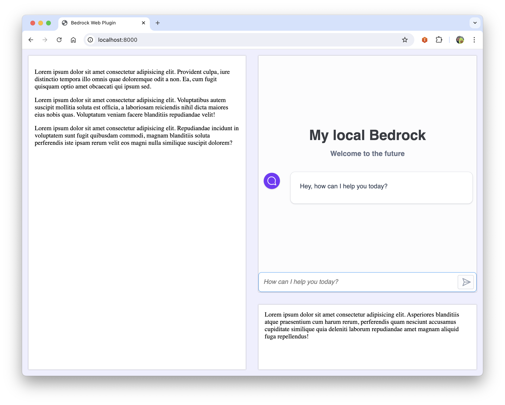

# bedrock-embed-web


```javascript
new AWSBRChat({
        auth: {
          region: "", // ex: us-west-2
          identityPoolId: "",
          // cognito: {
          //   userPoolId: ""
          // },
          anonymous: {
            roleArn: ""
          }
        },
        bedrock: {
          region: "",
          modelId?: "", // ex: anthropic.claude-3-sonnet-20240229-v1:0 (default)
         //   agent: {
         //     agentId: "",
         //     agentAliasId: ""
         //   }
        },
        ui: {
          floatingWindow: true,
          // containerId: "chat-container",
          webExperience?: {
            title: "My local Bedrock",
            subtitle: "Welcome to the future",
            welcomeMessage: "Hey, how can I help you today?"
          },
        },
        context?: "" // ex: "You are an expert in AWS Architecture"
      });

```

### Authentication
You may want to give access to Bedrock to non-authenticated users
- Set the `anonymous.roleArn` of your UnauthenticatedRole
if you want to give access to Bedrock to authenticated users
- Set the `cognito.userPoolId`

### How to call Bedrock
There are 2 ways to connect the plugin to Bedrock:
- By calling a model
Simply set the `modelId` parameter in the plugin to specify which model you want to call
- By calling a Bedrock Agent
Specify the `agent` parameter with the `agentId` and `agentAliasId`


### Position your chat window
- Specify the `floadintWindow: true` parameter if you want to have a floating window. The button will be located at the bottom right of your page
- Specify the id of a dom element in the `containerId` parameter
Make sure you have such node in your html. Ex:
```html
<div id="chat-container" style="height: 400px"></div>
```


<center>Chat window rendered in an html element</center>

## Exemple using the application in a React app using Amazon Amplify and Cognito

In your `App.tsx` file
```javascript
import amplifyConfig from "../amplify_outputs.json";
import { Hub } from 'aws-amplify/utils';
import { AWSBRChat } from "./aws-br-embed-ts";

let bedrockChat;

function App() {
    // ...
    const { authStatus } = useAuthenticator(context => [context.authStatus]);
    if (authStatus === "authenticated") {
        launchBedrockPlugin();
    }

    Hub.listen('auth', (data) => {
        if (data.payload.event == "signedIn") {
            launchBedrockPlugin();
        }
    });

    function launchBedrockPlugin() {
        if (!bedrockChat) {
            bedrockChat = new AWSBRChat({
                auth: {
                    region: amplifyConfig.auth.aws_region,
                    identityPoolId: amplifyConfig.auth.identity_pool_id,
                    cognito: {
                        userPoolId: amplifyConfig.auth.user_pool_client_id
                    }
                },
                bedrock: {
                    region: "us-west-2",
                    modelId: "anthropic.claude-3-sonnet-20240229-v1:0"
                },
                ui: {
                    floatingWindow: true,
                    webExperience: {
                        title: "My local Bedrock",
                        subtitle: "Welcome to the future",
                        welcomeMessage: "Hey, how can I help you today?"
                    }
                }
            });
        }
    }
}
```


### Run the sample website:
```bash
npm run build:website
```

### Build the library:

```bash
npm run build
```

Copy the `aws-br-embed.js` and `style.css` files in your project.

